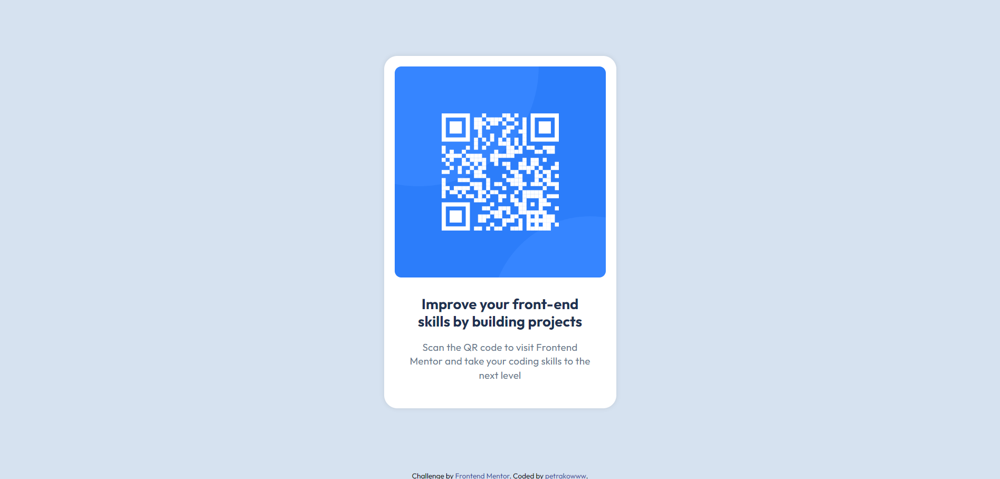

# Компонент QR-кода - Решение Frontend Mentor

Это решение для [челленджа "QR code component" на Frontend Mentor](https://www.frontendmentor.io/challenges/qr-code-component-iux_sIO_H). Челленджи на Frontend Mentor помогают улучшить навыки вёрстки, создавая реалистичные проекты.

## Содержание

- [Обзор](#обзор)
  - [Скриншот](#скриншот)
  - [Ссылки](#ссылки)
- [Мой процесс](#мой-процесс)
  - [Используемые технологии](#используемые-технологии)
  - [Чему я научился](#чему-я-научился)
- [Автор](#автор)

## Обзор

### Скриншот

### Ссылки

- [Репозиторий проекта](https://github.com/Petrakoow/FrontendMentorProjects)

## Мой процесс

### Используемые технологии

- Семантическая вёрстка HTML5
- SCSS для стилизации
- Flexbox для позиционирования
- Mobile-first подход

### Чему я научился

Этот проект помог мне улучшить навыки работы с CSS Flexbox и SCSS, а также лучше понять принципы адаптивной вёрстки. 

## Автор

- GitHub - [petrakowww](https://github.com/Petrakoow)

